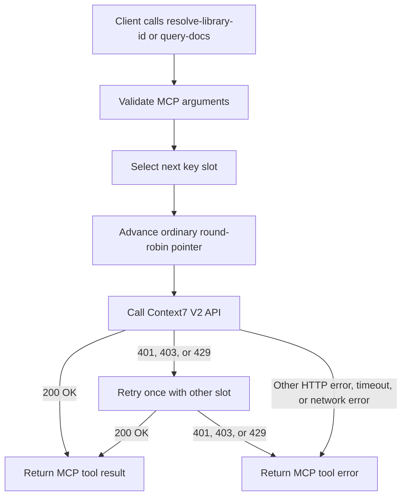

# Context7 Key Rotator MCP

A small remote [Model Context Protocol](https://modelcontextprotocol.io/) server for Context7 V2. It presents one Streamable HTTP MCP endpoint and exactly two tools:

- `resolve-library-id(libraryName, query)`
- `query-docs(libraryId, query)`

The deployed endpoint is:

```
https://context7.tyrannosaurus-magellanic.ts.net/mcp
```

It is published as the tailnet service `svc:context7` and is reachable only from inside the tailnet. Clients authenticate to the network boundary; they do not receive or store a Context7 key.

## How rotation works

`CONTEXT7_API_KEYS` must contain exactly two comma-separated keys. A process starts with slot 0, then selects slot 1, then slot 0 again for successive upstream operations. The counter is process-local and is reset when the container restarts.

`tools/list` is local MCP metadata: it never calls Context7 and never advances the key selector. Each `resolve-library-id` or `query-docs` call makes one logical Context7 operation.



The fallback does **not** advance the ordinary round-robin pointer a second time. For example, if slot 0 returns `429` and slot 1 succeeds, the next logical operation still begins on slot 1. This means an exhausted slot adds retry latency to the requests selected for it, but it does not make those requests fail while the alternate slot works.

Only `401`, `403`, and `429` cause an alternate-key retry. A `500`, malformed upstream response, network failure, or timeout is returned as a tool error without a retry because it is not evidence that the selected key is the problem.

## Boundaries and limitations

- Each upstream attempt has a 60-second timeout. A blocked response that arrives before that timeout may be followed by one alternate attempt, so one logical tool call can take up to roughly two upstream timeout windows. There is no unbounded wait for an upstream request.
- The service intentionally has no key cooldown, key scoring, session affinity, persistent state, OAuth flow, CLI adapter, or proxy cache. It is a two-key round-robin retry layer, not a quota manager.
- A container restart resets selection to slot 0. This is expected and does not alter the configured keys.
- There is no upstream-aware health endpoint. A running container proves only that the MCP server process is listening; prove Context7 availability with a real tool call.
- If both slots return a blocked status, the MCP call returns a normal tool error. It does not crash the server.

## Deployment topology

Production runs on the **homelab cluster** (Talos, reconciled by Flux) as one Deployment with two containers:

- `rotator` — the image published by `.github/workflows/publish.yml`, pinned by digest.
- `tailscale` — the stock `tailscale/tailscale` image running Tailscale Serve in userspace. It joins the tailnet as an ephemeral node, advertises `svc:context7`, and forwards `tcp:443` to `http://127.0.0.1:3000` over the pod's shared loopback.

Secrets reach the pod as ExternalSecrets sourced from Doppler. Nothing here or in the manifests holds a secret. Clients see the single stable name above; the workload moves by moving the pod.

The rotator previously ran on the physical Bloodarrow host from a checkout at `/opt/context7-key-rotator-mcp`, where Tailscale Serve on the host published `https://bloodarrow.tyrannosaurus-magellanic.ts.net/mcp` from the compose loopback port `127.0.0.1:23007`. That stack is retired once the cluster endpoint is cut over and verified. Rolling it back takes both halves of it, because compose republishes nothing on its own: `docker compose -f deploy/compose.yaml up -d --build` with the checkout still on the commit that was live when the stack was drained, and the host's Serve stanza put back.

## Client registration

Every installed native client uses one remote server named `context7`, whose target is the HTTPS endpoint above. The active registrations contain no bearer headers, API keys, stdio bridge, or direct `context7.com` MCP URL.

| Client | Active registration |
| --- | --- |
| Codex | `C:\Users\pmacl\.codex\config.toml` |
| Claude Code | `C:\Users\pmacl\.claude.json` |
| Cursor | `C:\Users\pmacl\.cursor\mcp.json` |
| VS Code Insiders | `C:\Users\pmacl\AppData\Roaming\Code - Insiders\User\mcp.json` |
| Kilo | `C:\Users\pmacl\.config\kilo\kilo.json` |
| OpenCode | `C:\Users\pmacl\.config\opencode\opencode.json` |
| GitHub Copilot CLI | `C:\Users\pmacl\.copilot\mcp-config.json` |
| Qwen Code | `C:\Users\pmacl\.qwen\settings.json` |
| Antigravity | `C:\Users\pmacl\.gemini\config\mcp_config.json` |
| Goose | `C:\Users\pmacl\AppData\Roaming\Block\goose\config\config.yaml` |

Start a fresh client session after changing a registration. The successful client-side discovery criterion is exactly these two tools:

```
resolve-library-id
query-docs
```

Claude Desktop has no active Context7 registration, so there was no direct entry to replace. Amp was uninstalled and is not a configured client. Timestamped configuration backups may retain prior settings for recovery, but they are not loaded by the clients.

For Codex, the active registration was replaced using its native CLI:

```powershell
codex mcp remove context7
codex mcp add context7 --url https://context7.tyrannosaurus-magellanic.ts.net/mcp
```

Clients registered against the old Bloodarrow URL keep working until that stack is drained; repoint each one at the URL above when it next needs a change.

## Local development and validation

```powershell
npm ci
npm test
npm run build
```

`deploy/compose.yaml` is the local container path: it builds the repository `Dockerfile`, binds the container to physical-host loopback only, and reads `CONTEXT7_API_KEYS` from a root-owned `0600` file at `/etc/context7-key-rotator-mcp/context7.env`, which is not part of this repository.

```bash
docker compose -f deploy/compose.yaml up -d --build
```

The automated suite is deterministic: it mocks Context7 V2 responses and verifies MCP protocol handling, tool discovery, result formatting, normal alternation, alternate-key retry for `401`/`403`/`429`, both-key failure, and integration-test server lifecycle. Green automated tests do **not** prove the current upstream service or credentials work.

Live validation is separate. Use a real client or a protocol client to verify `tools/list`, then call `resolve-library-id` and `query-docs` with a real library. A valid result has an actual Context7 library ID, nonempty documentation, and source links or code/documentation content appropriate to the request.
